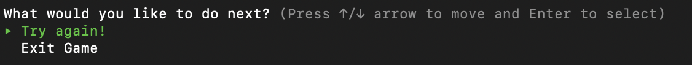

# **Are you smarter than a 5th grader?** 📚

## ArturoCaceres_T1A3 - Terminal App

### **Software Development Plan**

---

ArturoCaceres - [Terminal App](https://github.com/arturo-caceres/ArturoCaceres_T1A3)

**Description of the application**

<!-- As you, the reader are well aware, knowledge is power, and whatever the knowledge you aquire, it will get you to places; either profesionally or personally in life.  -->

The application developed, <em>"Are you smarter than a 5th grader?"</em> is a interactive game of 10 questions that challenge the user to get only correct answers, earning 100 points, 10 points per question, and win the game. All the questions are based on a 5th-grade book <em>"Brain Quest Workbook: Grade 5"</em>m which contains hundreds of curriculum-based activies, exercises and games in every subject. When you run the application you will have a menu of options (Start, About and Exit) in which you will choose the option you want.

When you select the `Start` option the game will begin. `About` will explain what is the purpose of the game and `Exit`, will terminate the application.


When the user selects the `Start` option, it will take you to the second view, in which you will have to input your name and age.
The purpose of asking the user's age is to show a specific message depending on their age group.


Once you have written your name and age, you will see the instructions of the game. It will show how many points you start the game with and will show the first question.


When you fail a question, you will get a prompt if you want to try again or if you want to exit the game.



**Problem it will solve**

Very easily, the user will know how rusty they are with the material they show fifth-grader nowadays. The main goal of creating this application not only was to interact with a funny game, but also to make the user realize how easy it is to forget basic knowledge.

**Target audience and the how they will use it.**

The target audience for this application is anyone between the ages of 7 and 99 years old. Anyone who is interested in a challenge, is welcome to play this game. By going through all the questions; the user will use this application to gain new knowledge, if they fail the question and decide to try again, and find out what the answer to the question is.

## **Features**

For the purpose of this project, these are 3 features of the application.

### User input

The user will input 2 parameters, their name and age. This will be on the initialize method defined on the class Player.

Throughout the game, these 2 parameters(name, age) will be used to greet the user and depending on the age of the user, the user will get a message when they lose.

```Ruby
class Player
  def initialize(name, age)
    @name = name
    @age = age
  end
```

### Counting points

When the user starts the game, they will start with 0 points, and they will have to answer all answers correctly to win the game. There are 10 questions worth 10 points each. After every correct answer, the user will see how many points they have accumulated, knowing how close they are to victory.

For the requirement of accumulating the points, points are saved on a variable called `game_points`, which is within a loop that will run until the user goes through all questions or fails a question. When it breaks, you will encounter the option if you want to `Try again!` or `Exit` the game. As long as you select `Try again!`, you will stay in that loop until you win.

```Ruby
continue_game = "Try again!"
  game_points = 0
  while game_points < 100 && continue_game == "Try again!"
    puts Rainbow("Instructions").green.underline.bright
    puts ""
    puts " Every question is worth 10 points. Your goal is to reach 100 points without failing a question. "
    puts " If you fail, you will start from the beginning.

    "
    puts " Are you ready to show everyone how easy these questions are?"
    puts "
    "

    puts " Current points = " + game_points.to_s
    puts "
    "

    Questions::GAME_QUESTIONS.each { |question_hash|
      user_answer = prompt.select(question_hash["question"], question_hash["options"])

      puts "
        "
      expected_answer = question_hash["answer"]

      if user_answer == expected_answer
        puts "Correct Answer"
        puts ""
        game_points += 10
        if game_points == 100
          puts game_points.to_s
          puts "Congratulations! You are #1"
          break
        end
      else
        puts "Incorrect Answer"
        puts p1.get_loser_message
        game_points = 0
        puts "Game over.

            "

        continue_game = prompt.select("What would you like to do next?", [{ name: "Try again!" }, { name: "Exit Game" }])

        if continue_game == "Try again!"
          puts `clear`
        else continue_game == "Exit Game"
          puts "
          "
          puts Rainbow("       █▀ █░█ ▄▀█ █▀▄▀█ █▀▀   █▀█ █▄░█   █▄█ █▀█ █░█ █  ").color(255, 0, 0).bright
          puts Rainbow("       ▄█ █▀█ █▀█ █░▀░█ ██▄   █▄█ █░▀█   ░█░ █▄█ █▄█ ▄  ").color(255, 0, 0).bright
          puts "

              "         end
        break
      end
      puts "Current points " + game_points.to_s
      puts ""
    }
  end
```

### Loser message

When the user misses a question, depending on their age group, they will receive a personalized message. This is so that the user will feel a more personalized experience when playing the game.

The user should be preferably from 7 to 99 years old. Younger kids under 7 can participate and try, but usually at that age is when they start learning to write properly. In the other spectrum, someone older than 99 can also try, but it would be rare to see a 100-year-old person trying to a game in the terminal. In the class Player, we define the method `gest_loser_message` to call the messages that the user will see once they lose.

Age groups with a message will go as follow:

```Ruby
def get_loser_message
    if @age >= 7 && @age <= 17
      return "Stay in school #{@name}! Please!"
    elsif @age >= 18 && @age <= 23
      return "Did you go to college #{@name}, it appears you skipped all clases or did the clases skipped you? Burn!"
    elsif @age >= 24 && @age <= 29
      return "What do you call a no brainer?
                    - You, #{@name}!"
    elsif @age >= 30 && @age <= 39
      return "You know how they say Thirty, Flirty and Thriving? In your case is more of Thirty, Foolish and Unsuccessful. Get it together #{@name}!"
    elsif @age >= 40 && @age <= 49
      return "Ouch, you know this is sad right? Maybe just google the answers #{@name}."
    elsif @age >= 50 && @age <= 99
      return "Wow, . . . I dont know what to say. Quick, say you need your reading glasses. Just never come back #{@name}."
    else
      return "I'm not sure how smart you should be at #{@age} years old, but you sure aren't smarter than a 5th grader."
    end
  end
```

**Error Handling**

By using TTY-prompt, the user only needs to choose between options, minimizing errors. Errors are being displayed within while's, so that the user will have to input the correct data, like for example age. The user can only write an age between 7 to 99. If they write any other value, they will get an error message.

## **User Experience and Interaction**

### How the user will find out how to interact with each feature

The application is very intuitive, so when the user sees the first view of the application, it will a smooth transition to glide through. A prompting tool has been implemented throughout the application. By just selecting options with arrow keys and pressing enter to select an option, the user should not encounter any type of difficulty, as it is very simplified for a better user experience.

### How the user will find out how to interact with each feature

By just entering the user's name and age, the application will run all features and give the user a personalized experience. By answering all answers correctly or by just failing as well, the user's name will show throughout the application.

### How errors will be handled and displayed to the user

The user is limited to what they should or shouldn't do, they have been given the essential tools to explore through the application without causing errors. The tools utilized for accomplishing pertinent limitations are restrictive conditions and conditional loops. For example, if the user attempts to write an age less than 7 or greater than 99, a condition will not allow this and a message will prompt asking to only add permitted values.

## **Control Flow**

This is the first draft of the application:


Final control flow:

With a a couple of changes and inputs, this was the final draft.


# Implementation Plan

The project management system Trello, was used to plan manage the project. Firstly all Requirements were added as an individual cards. After designing the the control flow of the application, and reading through all the requirements, the coding of the application was next.


Labels were also created to prioritize through cards.


Application's [Trello Board](https://trello.com/b/d4DiFUSZ)

## **Testing**


## Install

Install the prerequisites:

By running the following commands, you will not need to worry with the versions on your programs/libraries/gems.

1. `Clone` repo:

```Ruby
git clone https://github.com/arturo-caceres/ArturoCaceres_T1A3.git
```

2. For the installation of `bundler` and dependencies run:

```Ruby
sh install.sh
```

3. After `bundler` has been installed, to start application please run:

```Ruby
sh start.sh
```

**How to use?**

1. Please select `Start` to begin the game.
2. Enter your Name and Age.
3. Read the Instructions and select the correct answer.
4. Navigate through the answers by using the arrow keys on your keyboard followed by enter to make your selection
5. Win the game without making a mistake.

## References

1. Ruby-Doc, April 2021, [Site](https://ruby-doc.com/)
2. Ruby Gems. April 2021, [Site](https://rubygems.org/)
3. Bundler, Getting started. 15 Feb 2021 [Site](https://bundler.io/)
4. Brain Quest Workbook - Grade 5. By Bridget Heos, Matt Rockefeller. 2015

## **Enjoy the game and show everyone how smart you are by winning!**
